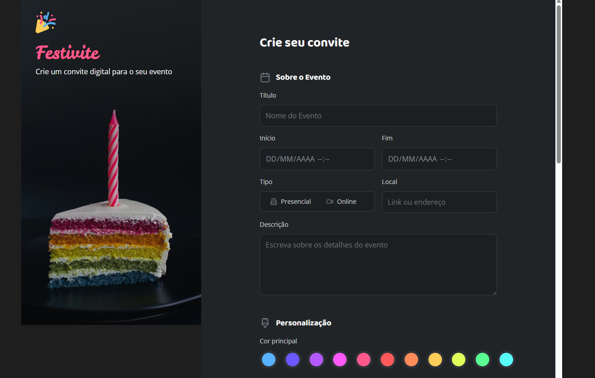

# Festivite - Gerador de Convites Digitais



Um projeto desenvolvido durante a jornada de estudos na Rocketseat. O Festivite é uma aplicação web para criar convites digitais personalizados para diversos tipos de eventos.

## 🎯 Funcionalidades

- **Criação de Convites**: Formulário completo para personalizar convites de eventos
- **Múltiplos Temas**: Suporte para diversos tipos de eventos (aniversário, casamento, formatura, etc.)
- **Personalização Visual**: Escolha de cores e estilos (claro/escuro)
- **Upload de Imagem**: Possibilidade de adicionar foto de capa personalizada
- **Responsivo**: Interface adaptada para dispositivos móveis e desktop

## 🎨 Temas Disponíveis

- Aniversário
- Infantil
- Formatura
- Casamento
- Chá de bebê
- Chá de panela
- Carnaval
- Páscoa
- São João
- Halloween
- Natal
- Outro

## 🛠 Tecnologias Utilizadas

- **HTML5**: Estrutura semântica do formulário
- **CSS3**: Estilização com CSS modular e variáveis customizadas
- **JavaScript**: Validações e interatividade do formulário
- **Google Fonts**: Tipografia personalizada (Baloo 2, Leckerli One, Open Sans)

## 📁 Estrutura do Projeto

```
Formulario-de-Convite/
├── index.html              # Página principal
├── assets/                 # Imagens e ícones
│   ├── preview.png         # Preview do projeto
│   ├── Logo.svg            # Logo da aplicação
│   ├── *.svg               # Ícones dos temas
│   └── icons/              # Ícones da interface
└── styles/                 # Arquivos CSS organizados
    ├── index.css           # Import principal
    ├── global.css          # Estilos globais
    ├── layout.css          # Layout da página
    ├── aside.css           # Sidebar
    ├── form.css            # Estilos do formulário
    ├── fields/             # Campos específicos
    └── utilities.css       # Classes utilitárias
```

## 🚀 Como Executar

1. Clone este repositório:

```bash
git clone https://github.com/seu-usuario/Formulario-de-Convite.git
```

2. Navegue até o diretório do projeto:

```bash
cd Formulario-de-Convite
```

3. Abra o arquivo `index.html` no seu navegador preferido

## 🎯 Objetivos de Aprendizado

Este projeto foi desenvolvido para praticar e aplicar conceitos fundamentais de desenvolvimento web:

- Estrutura HTML5 semântica
- CSS modular e organizado
- Formulários complexos com validação
- Design responsivo
- Acessibilidade
- Organização de arquivos e manutenibilidade

---

_Projeto desenvolvido durante os estudos na Rocketseat_ 🚀
